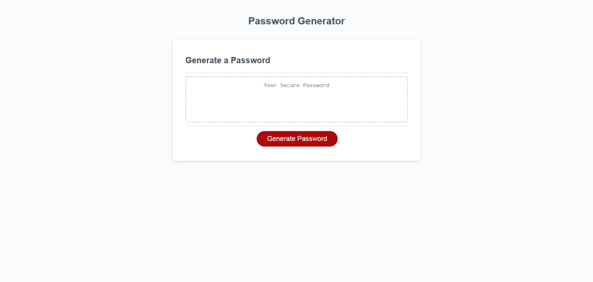

# thlancePWGen

This is a homework project to add javascript to a premade html/css webpage.

By clicking the generate password button, a script is run. The script will prompt to select options for a new password, then with the chosen options will build a new password and return it to the secure password box on the webpage. 

Screenshot:

URL: https://thlancegit.github.io/thlancePWGen/